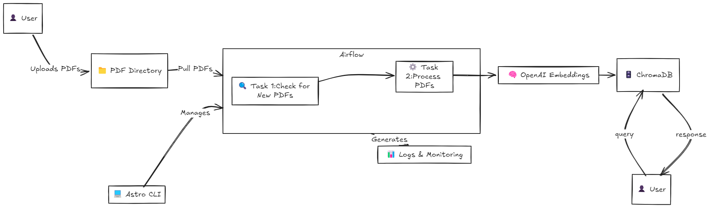

# Ai-Soc-Data-Engineering


## Architecture Diagram 

## Overview

This repository contains an Airflow DAG for ingesting, splitting, and embedding multiple PDFs into ChromaDB. The DAG runs every 5 minutes, checking for new PDFs in the specified directory and processing them if found. The setup uses Astro CLI for managing Airflow.

## Requirements

- **Docker**: Containerize your environment.
- **Astro CLI**: Command-line interface for managing Airflow with Astronomer.
- **Python**: Python 3.10 or later.

## Setup

### Clone the Repository

```bash
git clone https://github.com/quadriano31/Ai-Soc-Data-Engineering.git
cd Ai-Soc-Data-Engineering
```

# Configure Environment Variables

### Create a .env file in the root of the repository:

```bash
OPENAI_API_KEY=your_openai_api_key_here
PDF_DIR=data
CHROMA_PATH=chromadb
```

### Replace your_openai_api_key_here with your actual OpenAI API key

# Install Astro CLI
To install the Astro CLI, follow the instructions provided here.

[Astro CLI](https://www.astronomer.io/docs/astro/cli/install-cli)

# Initialize the Astro project:

```bash
astro dev init
```

# Start Airflow with Astro CLI
### Run the following command to start Airflow:

```bash
astro dev start
```

# Contributing
## Contributions are welcome! Please open an issue or submit a pull request with improvements.